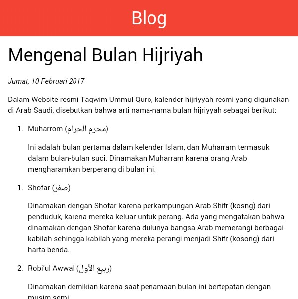
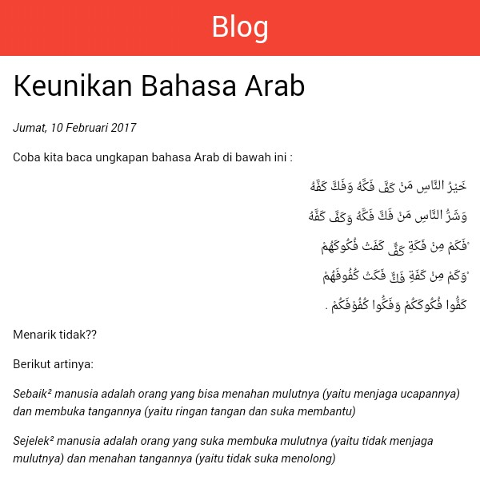

# Blog Offline

Sebuah platform blog secara offline yang dibangun dengan javascript `document.writeln` untuk `header` dan `footer`. Dengan platform ini, kamu juga bisa membuat desain tampilan sendiri, dan akan diolah menjadi Javascript dengan script Python yang tersedia di folder `_python`.

Platform ini menggunakan teknologi Marked JS yang berfungsi mengolah Markdown menjadi HTML, dengan sedikit perubahan sehingga untuk teks kanan ke kiri seperti huruf Arab, akan otomatis arahnya kanan ke kiri.

Terinspirasi dari Jekyll, susahnya mencari _wifi_ gratis, dan laptop hilang.

Contoh: http://muhammadzaini.com/blog-offline
